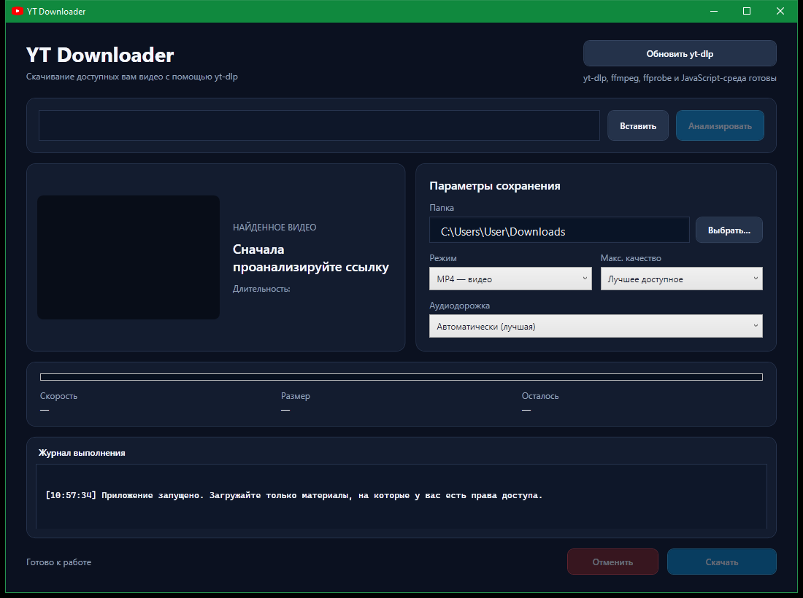
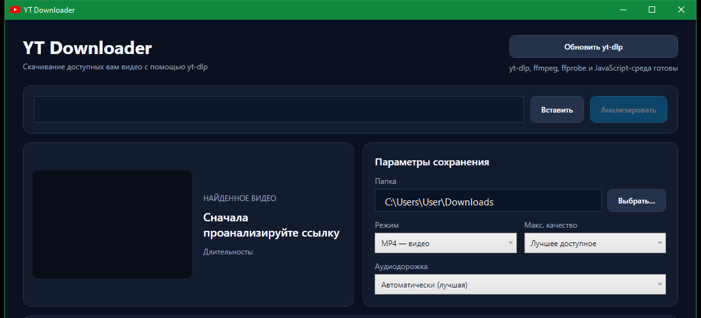

# YT Downloader

Настольное WPF-приложение для Windows, которое анализирует ссылку, показывает сведения о найденном видео и скачивает доступные пользователю материалы через [yt-dlp](https://github.com/yt-dlp/yt-dlp). Для объединения видео- и аудиопотоков, проверки медиаданных и извлечения MP3 используются инструменты проекта [FFmpeg](https://ffmpeg.org/), а Node.js предоставляет yt-dlp среду выполнения JavaScript.

> Используйте приложение только для материалов, которые вам разрешено скачивать правообладателем или законом. Поддержка сайта инструментом не означает, что скачивание любого размещённого там материала разрешено.

## Интерфейс



В верхней части окна находятся поле ссылки, запуск анализа и обновление yt-dlp. После анализа приложение показывает название, длительность, миниатюру и доступные аудиодорожки. Справа выбираются папка, режим, ограничение качества и, при необходимости, браузерная сессия для прохождения проверки YouTube.



Нижняя часть окна содержит прогресс, скорость, объём полученных данных, оставшееся время, журнал yt-dlp и кнопки запуска или отмены операции.

## Возможности

- анализ отдельных видео и целых плейлистов;
- отображение названия, длительности и миниатюры видео либо количества элементов плейлиста;
- сохранение элементов плейлиста в отдельную папку с номером позиции в имени файла;
- получение списка доступных аудиодорожек и языков;
- сохранение MP4-видео или извлечение MP3-аудио с максимальным качеством;
- ограничение разрешения: лучшее доступное, 2160p, 1440p, 1080p, 720p или 480p;
- объединение раздельных видео- и аудиопотоков в MP4;
- отображение процента, позиции в плейлисте, скорости, размера, оставшегося времени и журнала выполнения;
- светлая и тёмная темы с переключением без перезапуска;
- отмена операции с завершением всего дерева дочернего процесса;
- обновление автономного `yt-dlp.exe` кнопкой в интерфейсе;
- автоматическое получение свежих медиассылок и один повтор загрузки при HTTP 403;
- использование cookies явно выбранного браузера для CAPTCHA и доступных пользователю материалов;
- сохранение последней папки, режима, качества, браузерной сессии, режима плейлиста и темы в `%LOCALAPPDATA%\YtDlpDownloader\settings.json`;
- защита от одновременного запуска нескольких скачиваний.

## Как проходит операция

1. Приложение проверяет ссылку и запускает `yt-dlp.exe` напрямую через `System.Diagnostics.Process`, без `cmd.exe`.
2. Для анализа yt-dlp возвращает JSON с метаданными и форматами; для плейлиста используется быстрый плоский список элементов без загрузки форматов каждого видео.
3. При работе с YouTube путь к `node.exe` передаётся yt-dlp через `--js-runtimes`. JavaScript-среда нужна для решения актуальных проверок проигрывателя YouTube, а клиент проигрывателя выбирает сам yt-dlp согласно текущей логике экстрактора.
4. При скачивании yt-dlp выбирает потоки по режиму и ограничению разрешения. Путь к FFmpeg передаётся через `--ffmpeg-location`.
5. `ffmpeg.exe` объединяет раздельные потоки в MP4 или извлекает аудио в MP3. `ffprobe.exe` доступен yt-dlp для анализа медиапотоков и задач постобработки.
6. Машиночитаемый UTF-8-вывод `--progress-template` преобразуется в состояние интерфейса. Прогресс раздельных видео- и аудиопотоков объединяется пропорционально их размеру, а для плейлиста дополнительно учитываются текущая позиция и общее количество элементов. При HTTP 403 приложение один раз перезапускает yt-dlp, сохраняя монотонный прогресс. При отмене дочерний процесс завершается целиком.

### Проверка CAPTCHA YouTube

Если журнал содержит `Sign in to confirm you're not a bot`, это не всегда означает, что видео требует аккаунт: YouTube мог временно ограничить гостевые запросы с текущего IP. Откройте ролик в обычном (не приватном) окне браузера, пройдите CAPTCHA, затем выберите этот же браузер в поле «Сессия браузера» и снова запустите анализ. Вход в аккаунт для общедоступного видео не обязателен.

По умолчанию установлено «Не использовать», и приложение не читает cookies. При выборе браузера `yt-dlp` получает доступ к его локальному хранилищу cookies; используйте эту возможность только при необходимости. Если браузер открыт под учётной записью YouTube, запросы могут выполняться от её имени.

## Сторонние компоненты

Все четыре файла должны находиться рядом в каталоге `YT_downloader/YT_downloader/Tools`. Во время обычной сборки MSBuild копирует их в выходной каталог, а при публикации — в комплект приложения.

| Файл | Версия в проверенном локальном комплекте | Назначение | Первоисточник и репозиторий |
| --- | --- | --- | --- |
| `yt-dlp.exe` | `2026.08.19` | Получение метаданных и форматов, скачивание потоков, выбор аудиодорожки, вывод прогресса и запуск постобработки. | [Проект и документация](https://github.com/yt-dlp/yt-dlp), [официальные выпуски](https://github.com/yt-dlp/yt-dlp/releases), [список поддерживаемых сайтов](https://github.com/yt-dlp/yt-dlp/blob/master/supportedsites.md) |
| `ffmpeg.exe` | `8.1.2-full_build-www.gyan.dev` | Универсальный медиаконвертер: объединяет видео и аудио, формирует MP4 и кодирует MP3. | [Документация ffmpeg](https://ffmpeg.org/ffmpeg.html), [главный Git-репозиторий](https://git.ffmpeg.org/ffmpeg.git), [официальное зеркало GitHub](https://github.com/FFmpeg/FFmpeg), [Windows-сборки gyan.dev](https://www.gyan.dev/ffmpeg/builds/) |
| `ffprobe.exe` | `8.1.2-full_build-www.gyan.dev` | Анализатор медиаконтейнеров и потоков; выводит сведения в удобном для программ формате и используется yt-dlp вместе с FFmpeg. | [Документация ffprobe](https://ffmpeg.org/ffprobe.html), [главный Git-репозиторий](https://git.ffmpeg.org/ffmpeg.git), [официальное зеркало GitHub](https://github.com/FFmpeg/FFmpeg), [Windows-сборки gyan.dev](https://www.gyan.dev/ffmpeg/builds/) |
| `node.exe` | `v24.18.0` | Среда выполнения JavaScript, передаваемая yt-dlp для полной поддержки YouTube и внешних EJS-сценариев. | [Сайт и загрузка Node.js](https://nodejs.org/en/download/), [репозиторий nodejs/node](https://github.com/nodejs/node), [руководство yt-dlp по JS-средам](https://github.com/yt-dlp/yt-dlp/wiki/EJS) |

Версии выше получены командами `yt-dlp --version`, `ffmpeg -version`, `ffprobe -version` и `node --version`. Они описывают локальный комплект на момент обновления README и могут измениться после замены файлов или обновления yt-dlp.

### Важные замечания об источниках

- FFmpeg официально распространяет исходный код и на [странице загрузки](https://ffmpeg.org/download.html) ссылается на сторонние готовые сборки для Windows. Строка версии включённых файлов указывает на full build от [gyan.dev](https://www.gyan.dev/ffmpeg/builds/).
- `ffmpeg.exe` и `ffprobe.exe` собраны из одного дерева исходного кода FFmpeg, но выполняют разные задачи.
- yt-dlp рекомендует FFmpeg, ffprobe и поддерживаемую JavaScript-среду; для Node.js актуальные версии yt-dlp требуют Node 22 или новее. Подробности приведены в [разделе Dependencies](https://github.com/yt-dlp/yt-dlp#dependencies) и [руководстве EJS](https://github.com/yt-dlp/yt-dlp/wiki/EJS).
- У компонентов независимые лицензии. Перед распространением готового комплекта проверьте [лицензию yt-dlp](https://github.com/yt-dlp/yt-dlp/blob/master/LICENSE), [правовые сведения FFmpeg](https://ffmpeg.org/legal.html), параметры конкретной FFmpeg-сборки и [лицензию Node.js](https://github.com/nodejs/node/blob/main/LICENSE).

## Подготовка каталога Tools

Исполняемые файлы исключены из Git правилом `*.exe`, поэтому после обычного клонирования репозитория их нужно добавить вручную:

```text
YT_downloader/
└── YT_downloader/
    └── Tools/
        ├── yt-dlp.exe
        ├── ffmpeg.exe
        ├── ffprobe.exe
        └── node.exe
```

Рекомендуемый порядок:

1. Скачайте `yt-dlp.exe` из [официального выпуска yt-dlp](https://github.com/yt-dlp/yt-dlp/releases/latest).
2. Скачайте Windows-сборку FFmpeg по ссылке с [официальной страницы FFmpeg](https://ffmpeg.org/download.html#build-windows) и возьмите из её каталога `bin` файлы `ffmpeg.exe` и `ffprobe.exe`.
3. Скачайте 64-битный архив Node.js для Windows с [официальной страницы](https://nodejs.org/en/download/) и скопируйте `node.exe`. Для текущих версий yt-dlp используйте Node.js 22 или новее.
4. Проверьте комплект:

```powershell
.\YT_downloader\YT_downloader\Tools\yt-dlp.exe --version
.\YT_downloader\YT_downloader\Tools\ffmpeg.exe -version
.\YT_downloader\YT_downloader\Tools\ffprobe.exe -version
.\YT_downloader\YT_downloader\Tools\node.exe --version
```

`ffplay.exe` приложению не требуется.

## Требования для разработки

- Windows 10/11 x64;
- [.NET 10 SDK](https://dotnet.microsoft.com/download/dotnet/10.0);
- Visual Studio с поддержкой WPF или командная строка `dotnet`;
- доступ к NuGet при первом восстановлении пакетов тестового проекта;
- заполненный каталог `Tools` для анализа и скачивания.

## Сборка, запуск и тесты

Команды выполняются из корня репозитория:

```powershell
dotnet restore .\YT_downloader\YT_downloader.slnx
dotnet build .\YT_downloader\YT_downloader.slnx -c Release
dotnet run --project .\YT_downloader\YT_downloader\YT_downloader.csproj
dotnet test .\YT_downloader\YT_downloader.slnx -c Release
```

## Self-contained публикация для Windows x64

Профиль `Properties/PublishProfiles/win-x64.pubxml` создаёт self-contained single-file приложение. В комплект включаются .NET 10 Runtime и файлы из `Tools`, поэтому на целевом компьютере не нужно отдельно устанавливать .NET или Node.js.

```powershell
dotnet publish .\YT_downloader\YT_downloader\YT_downloader.csproj `
  -c Release `
  -p:PublishProfile=win-x64
```

Результат появится в `YT_downloader/YT_downloader/bin/Release/net10.0-windows/win-x64/publish/`.

Эквивалентная команда без профиля:

```powershell
dotnet publish .\YT_downloader\YT_downloader\YT_downloader.csproj `
  -c Release `
  -r win-x64 `
  --self-contained true `
  -p:PublishSingleFile=true `
  -p:IncludeAllContentForSelfExtract=true `
  -p:EnableCompressionInSingleFile=true
```

## Структура проекта

- `Views` — WPF-окна;
- `ViewModels` — состояние интерфейса и пользовательские сценарии;
- `Models` — модели видео, загрузки, прогресса и настроек;
- `Services` — запуск yt-dlp, разбор вывода, настройки и системные диалоги;
- `Commands` — синхронные и асинхронные MVVM-команды;
- `Tools` — локальные исполняемые файлы yt-dlp, FFmpeg/ffprobe и Node.js;
- `YT_downloader.Tests` — модульные тесты аргументов и парсеров yt-dlp.

## Ограничения и диагностика

- Приложение не запускает `cmd.exe`: аргументы передаются через `ProcessStartInfo.ArgumentList`, поэтому ссылки и пути не собираются вручную в командную строку.
- По умолчанию ссылка обрабатывается как одно видео. Для загрузки всех элементов нужно включить флажок «Скачать весь плейлист» до анализа.
- Для плейлиста аудиодорожка выбирается автоматически, поскольку набор доступных дорожек может отличаться у каждого видео.
- После отмены может остаться файл `.part`; yt-dlp обычно использует его для продолжения следующей загрузки.
- CAPTCHA из приватного окна нельзя автоматически передать приложению: приватная сессия изолирована. Пройдите проверку в обычном профиле выбранного браузера либо используйте отдельный профиль без входа в аккаунт.
- Если в правом верхнем углу указано, что компонент не найден, проверьте имена файлов и каталог `Tools`. Подробный вывод yt-dlp отображается в журнале выполнения.
